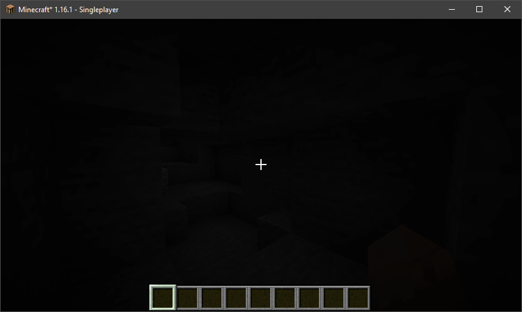

# Fullbright
Minecraft mod to increase the game's brightness past the default value.

## Dependencies
This mod is written with [Fabric](https://fabricmc.net/). Please set that up first. It will **NOT** work with Forge.

Along with running Fabric, you need to install these 2 mods:
- [Fabric API](https://www.curseforge.com/minecraft/mc-mods/fabric-api)
- [Mod Menu](https://www.curseforge.com/minecraft/mc-mods/modmenu)

